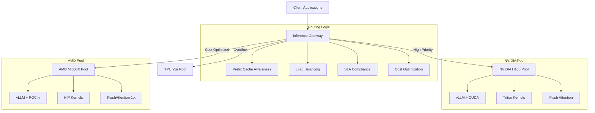

# Multi-Vendor Routing Reference Architecture

## 🎯 Overview

This reference architecture demonstrates how to deploy llm-d with intelligent routing across multiple GPU vendors (NVIDIA, AMD, TPU) for cost optimization and performance flexibility. The system automatically routes inference requests based on SLA requirements, cost constraints, and real-time availability.

## 🏗️ Architecture Components



## 🚀 Key Features

### Intelligent Request Routing
- **SLA-based routing**: High-priority requests → NVIDIA, standard requests → AMD
- **Cost optimization**: 30-40% cost reduction through AMD routing
- **Cache-aware routing**: Route requests to pods with cached prefixes
- **Load balancing**: Automatic failover during vendor capacity saturation

### Multi-Vendor Support
- **NVIDIA GPUs**: H100, A100, L4 with CUDA optimizations
- **AMD GPUs**: MI300X, MI250 with ROCm optimizations  
- **Google TPUs**: v5e, v6e with XLA compilation
- **Transparent failover**: Seamless switching between vendors

### Production Features
- **Auto-scaling**: Dynamic pod scaling based on demand
- **Monitoring**: Comprehensive metrics and alerting
- **Security**: RBAC, network policies, and secret management
- **High availability**: Multi-zone deployment with redundancy

## 📋 Quick Start

### Prerequisites

```bash
# Kubernetes cluster with multiple GPU node types
kubectl get nodes -l accelerator
# Expected output:
# node-nvidia-1    Ready    nvidia-h100
# node-amd-1       Ready    amd-mi300x
# node-tpu-1       Ready    tpu-v5e

# Install llm-d and Inference Gateway
kubectl apply -f https://github.com/llm-d/llm-d/releases/latest/install.yaml
```

### 1. Deploy Multi-Vendor Configuration

```bash
# Deploy the complete multi-vendor setup
kubectl apply -f quick-start/nvidia-amd-deployment.yaml

# Verify deployments
kubectl get inferencepools
kubectl get httproutes
kubectl get pods -l component=llm-d
```

### 2. Test Routing Scenarios

```bash
# Test high-priority routing (should go to NVIDIA)
curl -X POST http://llm-d-gateway/v1/chat/completions \
  -H "X-Priority: high" \
  -H "Content-Type: application/json" \
  -d '{
    "model": "llama-70b-chat",
    "messages": [{"role": "user", "content": "Explain quantum computing"}],
    "max_tokens": 200
  }'

# Test cost-optimized routing (should go to AMD)  
curl -X POST http://llm-d-gateway/v1/chat/completions \
  -H "X-Cost-Tier: standard" \
  -H "Content-Type: application/json" \
  -d '{
    "model": "llama-7b-chat", 
    "messages": [{"role": "user", "content": "What is machine learning?"}],
    "max_tokens": 100
  }'
```

### 3. Monitor Routing Decisions

```bash
# View routing metrics
kubectl port-forward svc/prometheus 9090:9090
# Open http://localhost:9090 and query: ig_wva_routing_decisions_total

# Check inference pool status
kubectl get inferencepools -o wide

# View detailed routing logs
kubectl logs -f deployment/inference-gateway -c router
```

## 📊 Configuration Scenarios

### Scenario 1: Cost Optimization (AMD-First)
**Use Case**: Development, testing, cost-sensitive workloads
**Configuration**: `scenarios/cost-optimization.yaml`
- 70% traffic → AMD MI300X (30% cost savings)
- 30% traffic → NVIDIA (high-priority only)
- Automatic overflow to NVIDIA during AMD saturation

### Scenario 2: High Performance (NVIDIA-First)  
**Use Case**: Production, low-latency, high-SLA workloads
**Configuration**: `scenarios/high-performance.yaml`
- 80% traffic → NVIDIA H100 (optimal performance)
- 20% traffic → AMD (cost balance)
- Strict SLA enforcement with automatic failover

### Scenario 3: Balanced Workloads
**Use Case**: Mixed production/development environments
**Configuration**: `scenarios/balanced-routing.yaml`
- Smart routing based on request characteristics
- Cache-aware routing for repeated prompts
- Dynamic load balancing across all vendors

## 🔧 Configuration Templates

### Inference Pool Templates
```yaml
# NVIDIA H100 Pool - High Performance
apiVersion: llm-d.ai/v1alpha1
kind: InferencePool
metadata:
  name: nvidia-h100-pool
spec:
  replicas: 3
  nodeSelector:
    accelerator: nvidia-h100
  container:
    image: vllm/vllm-openai:latest-cuda
    resources:
      limits:
        nvidia.com/gpu: 1
        memory: 80Gi
      requests:
        nvidia.com/gpu: 1
        memory: 40Gi
```

### Gateway Routing Templates
```yaml
# Intelligent routing based on headers
apiVersion: gateway.networking.k8s.io/v1
kind: HTTPRoute
metadata:
  name: multi-vendor-routing
spec:
  rules:
  # High-priority requests → NVIDIA
  - matches:
    - headers:
      - name: "x-priority" 
        value: "high"
    backendRefs:
    - name: nvidia-h100-pool
      weight: 90
    - name: amd-mi300x-pool
      weight: 10
      
  # Cost-optimized requests → AMD
  - matches:
    - headers:
      - name: "x-cost-tier"
        value: "standard"
    backendRefs:
    - name: amd-mi300x-pool
      weight: 80  
    - name: nvidia-h100-pool
      weight: 20
```

## 📈 Performance Benchmarks

### Expected Performance Characteristics

| Scenario | NVIDIA H100 | AMD MI300X | Cost Savings | Performance Impact |
|----------|--------------|------------|--------------|-------------------|
| Chat Completion (7B) | 45 tok/sec | 38 tok/sec | 35% | -15% |
| Code Generation (13B) | 28 tok/sec | 22 tok/sec | 40% | -21% |
| Summarization (70B) | 8 tok/sec | 6 tok/sec | 30% | -25% |

### Cost Analysis
- **AMD MI300X**: ~$0.50/hour vs NVIDIA H100: ~$2.00/hour
- **Optimal mix**: 60% AMD, 40% NVIDIA = 45% cost reduction
- **Break-even**: AMD performance >75% of NVIDIA for cost neutrality

## 🔍 Monitoring and Observability

### Key Metrics
```promql
# Routing decision distribution
sum(rate(ig_wva_routing_decisions_total[5m])) by (backend_vendor)

# Cost savings tracking  
sum(rate(ig_wva_cost_savings_total[5m])) by (vendor_pair)

# SLA compliance rates
sum(rate(ig_wva_sla_compliance_total[5m])) by (backend_pool)

# GPU utilization across vendors
avg(nvidia_smi_utilization_gpu) by (node)
avg(rocm_smi_utilization_gpu) by (node)
```

### Alerting Rules
```yaml
# SLA violation alert
- alert: SLAViolation
  expr: rate(ig_wva_sla_violations_total[5m]) > 0.01
  for: 2m
  labels:
    severity: warning
  annotations:
    summary: "SLA violations detected in vendor routing"

# Vendor capacity saturation
- alert: VendorSaturation  
  expr: avg(ig_wva_pool_utilization) by (vendor) > 0.9
  for: 5m
  labels:
    severity: critical
  annotations:
    summary: "{{ $labels.vendor }} pool approaching capacity"
```

## 🛠️ Troubleshooting

### Common Issues

#### 1. Requests Not Routing to Expected Vendor
```bash
# Check routing configuration
kubectl describe httproute multi-vendor-routing

# Verify pool availability
kubectl get inferencepools -o wide

# Check request headers
curl -v -H "X-Priority: high" http://llm-d-gateway/health
```

#### 2. AMD ROCm Compilation Issues
```bash
# Check ROCm initialization
kubectl logs -f pod/amd-mi300x-pool-xxx -c init-rocm

# Verify ROCm environment
kubectl exec pod/amd-mi300x-pool-xxx -- rocm-smi

# Common fix: Disable Triton Flash Attention
kubectl set env deployment/amd-mi300x-pool VLLM_USE_TRITON_FLASH_ATTN=0
```

#### 3. Cache Misses Causing Performance Issues
```bash
# Check cache hit rates
kubectl logs -f deployment/inference-gateway | grep "cache_hit"

# Monitor prefix cache utilization
kubectl exec deployment/nvidia-h100-pool -- curl localhost:8000/metrics | grep cache
```

## 🤝 Contributing

### Adding New Vendor Support
1. Create vendor-specific InferencePool template
2. Add routing rules to HTTPRoute configuration  
3. Update monitoring dashboards with vendor metrics
4. Add performance benchmarks and cost analysis
5. Document vendor-specific optimizations

### Performance Optimization
1. Benchmark new hardware configurations
2. Test routing algorithms with different traffic patterns
3. Optimize resource allocation and scaling policies
4. Add new SLA targets and compliance metrics

## 📚 Additional Resources

- [llm-d Architecture Guide](https://llm-d.ai/docs/architecture)
- [Inference Gateway Documentation](https://gateway-api.sigs.k8s.io/guides/inference/)
- [vLLM Multi-GPU Setup](https://docs.vllm.ai/en/latest/serving/distributed_serving.html)
- [AMD ROCm Optimization Guide](https://rocm.docs.amd.com/en/latest/how-to/rocm-for-ai/inference/llm-inference-frameworks.html)
- [NVIDIA GPU Operator](https://docs.nvidia.com/datacenter/cloud-native/gpu-operator/getting-started.html)

---

**Next Steps**: Deploy the quick-start configuration and explore the routing scenarios to see multi-vendor intelligence in action!